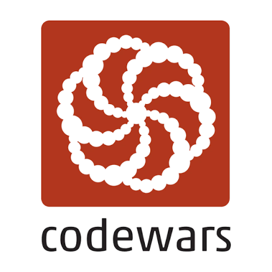

<table border="0">
  <tr>
    <td width="350" align="center" valign="top">
       
      
    </td>
    <td valign="top">
      <h2>🥋 Codewars Solutions — Python</h2>
      

        Assalomu alaykum! Ushbu repozitoriyda <b>Codewars</b> platformasidagi masalalar yechimi, algoritmlar va ma'lumotlar tuzilmalari ustida olib borilayotgan amaliyotlarim jamlangan.
      

      <ul>
        <li><b>Dasturlash tili:</b> Python</li>
        <li><b>Profil:</b> <a href="https://www.codewars.com/users/JavlonbekSaidov-Developer">Saidov Javlonbek</a></li>
        <li><b>Maqsad:</b> Muammolarni hal qilish (Problem Solving) ko'nikmalarini oshirish va Pythonic, toza kod yozish.</li>
      </ul>
    </td>
  </tr>
</table>

 

## 📊 Yechilgan masalalar statistikasi

Quyidagi jadvalda masalalar darajalari (kyu) bo'yicha ajratilgan yechimlar ro'yxati keltirilgan:

| Kyu | Qiyinchilik darajasi | Ishlatilgan til | Manzil |
| :---: | :--- | :---: | :---: |
| 🟢 **8 kyu** | Beginner | Python | [`📁 /8-kyu`](./8-kyu) |
| 🟡 **7 kyu** | Easy | Python | [`📁 /7-kyu`](./7-kyu) |
| 🟠 **6 kyu** | Medium | Python | [`📁 /6-kyu`](./6-kyu) |
| 🔴 **5 kyu** | Hard | Python | [`📁 /5-kyu`](./5-kyu) |
| 🟣 **4 kyu** | Very Hard | Python | [`📁 /4-kyu`](./4-kyu) |
| 🔵 **3 kyu** | Expert | Python | [`📁 /3-kyu`](./3-kyu) |
| ⚫ **2 kyu** | Master | Python | [`📁 /2-kyu`](./2-kyu) |
| ⚪ **1 kyu** | Grandmaster | Python | [`📁 /1-kyu`](./1-kyu) |

---

> 💡 *Masalalar kodlari va izohlari doimiy ravishda yangilanib boriladi.*
